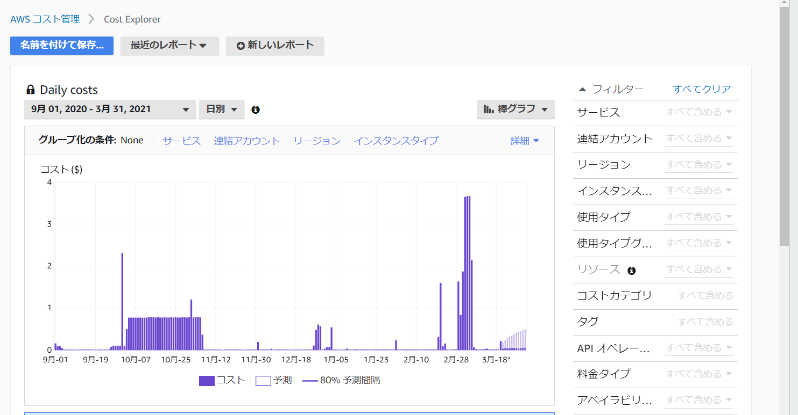
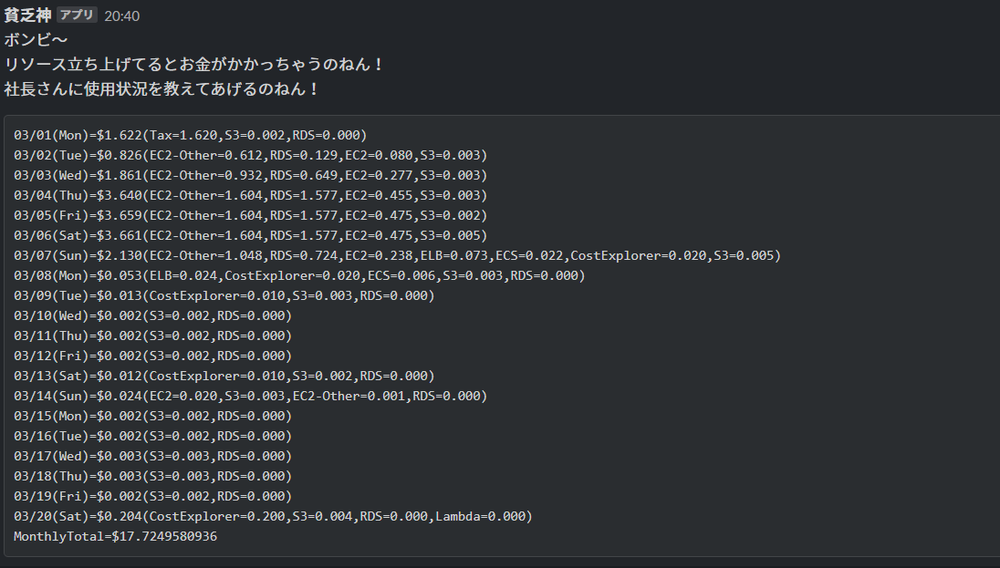

# AWSのコストレポートをSlackに通知

## 概要
AWSでコストレポートを参照できます。
これを定期的に確認するのは手間がかかるので、Slackに通知を出す機能です。
- コストレポート

これを、slackに通知します。

- Slack

## 実装
Lambdaを使っています。

- ランタイム：.NET Core3.1
- 追加パッケージ
    - AWSSDK.CostExplorer
    - Slack.Webhooks

## 環境構築
### Slack
Incoming Webhookを使用します。

以下ページを参照して、Webhook URLを発行します。

https://slack.com/intl/ja-jp/help/articles/115005265063-Slack-%E3%81%A7%E3%81%AE-Incoming-Webhook-%E3%81%AE%E5%88%A9%E7%94%A8

### Lambda
- ランタイム
    - .NET Core3.1

- ハンドラ
    - AWSCostReportLambda::AWSCostReportLambda.Function::FunctionHandler

- 設定/環境変数
    - キー： SlackIncomingWebhookUrl
    - 値： SlackのWebhook URL

- 設定/アクセス権限
    - 実行ロールに以下ポリシーを追加
        - サービス:Cost Explorer
        - アクション:GetCostAndUsage

infraフォルダにterraformを保存しています。

## 備忘
### dotnet lambdaコマンドのインストール
`dotnet tool install -g Amazon.Lambda.Tools`

### Lambdaのデプロイ
`dotnet lambda deploy-function`
